# Autocomplete & NextEdit Dependency Graph

## Overview

This document provides a detailed dependency map showing what [`CompletionProvider.ts`](core/autocomplete/CompletionProvider.ts) and [`NextEditProvider.ts`](core/nextEdit/NextEditProvider.ts) actually use from the core codebase. This analysis identifies which directories are critical, which can be replaced, and which can be safely removed.

## Entry Points Analysis

### CompletionProvider.ts Direct Imports

**Config & Infrastructure:**

- [`ConfigHandler`](core/config/ConfigHandler.ts) - Configuration management
- [`IDE, ILLM`](core/index.ts) - Core interfaces
- [`OpenAI`](core/llm/llms/OpenAI.ts) - LLM provider
- [`DEFAULT_AUTOCOMPLETE_OPTS`](core/util/parameters.ts) - Default options

**Core Autocomplete Logic:**

- [`shouldCompleteMultiline`](core/autocomplete/classification/shouldCompleteMultiline.ts) - Multiline classification
- [`ContextRetrievalService`](core/autocomplete/context/ContextRetrievalService.ts) - Context gathering
- [`BracketMatchingService`](core/autocomplete/filtering/BracketMatchingService.ts) - Bracket filtering
- [`CompletionStreamer`](core/autocomplete/generation/CompletionStreamer.ts) - Streaming completions
- [`postprocessCompletion`](core/autocomplete/postprocessing/index.ts) - Post-processing
- [`shouldPrefilter`](core/autocomplete/prefiltering/index.ts) - Pre-filtering
- [`getAllSnippetsWithoutRace`](core/autocomplete/snippets/index.ts) - Code snippets
- [`renderPromptWithTokenLimit`](core/autocomplete/templating/index.ts) - Prompt rendering

**Utilities:**

- [`isSecurityConcern`](core/indexing/ignore.ts) - Security checks
- [`AutocompleteDebouncer`](core/autocomplete/util/AutocompleteDebouncer.ts) - Debouncing
- [`AutocompleteLoggingService`](core/autocomplete/util/AutocompleteLoggingService.ts) - Logging
- [`AutocompleteLruCache`](core/autocomplete/util/AutocompleteLruCache.ts) - Caching
- [`HelperVars`](core/autocomplete/util/HelperVars.ts) - Helper utilities
- Types from [`./types.ts`](core/autocomplete/types.ts) and [`./util/types.ts`](core/autocomplete/util/types.ts)

### NextEditProvider.ts Direct Imports

**Shared with CompletionProvider:**

- All autocomplete infrastructure (ContextRetrievalService, BracketMatchingService, CompletionStreamer, etc.)
- Config and LLM systems
- Same utility classes

**NextEdit-Specific:**

- [`modelSupportsNextEdit`](core/llm/autodetect.ts) - Model capability checking
- [`DocumentHistoryTracker`](core/nextEdit/DocumentHistoryTracker.ts) - Document history
- [`NextEditLoggingService`](core/nextEdit/NextEditLoggingService.ts) - NextEdit logging
- [`PrefetchQueue`](core/nextEdit/NextEditPrefetchQueue.ts) - Prefetch management
- [`NextEditProviderFactory`](core/nextEdit/NextEditProviderFactory.ts) - Provider factory
- [`BaseNextEditModelProvider`](core/nextEdit/providers/BaseNextEditProvider.ts) - Model providers
- [`createDiff, DiffFormatType`](core/nextEdit/context/diffFormatting.ts) - Diff formatting
- [`getAst`](core/autocomplete/util/ast.ts) - AST parsing
- [`localPathOrUriToPath`](core/util/pathToUri.ts) - Path utilities

## Dependency Tree

```
CompletionProvider & NextEditProvider (Entry Points)
│
├── config/
│   ├── ConfigHandler ⚠️ REPLACEABLE
│   │   ├── control-plane/ 🔴 COMPLEX DEPENDENCY
│   │   │   ├── client.ts
│   │   │   ├── AuthTypes.ts
│   │   │   ├── env.ts
│   │   │   ├── PolicySingleton.ts
│   │   │   └── analytics/ (PostHog, LogStash)
│   │   ├── yaml-package/ ⚠️ COMPLEX CONFIG SYSTEM
│   │   │   ├── load/
│   │   │   ├── schemas/
│   │   │   └── interfaces/
│   │   ├── profile/
│   │   │   ├── LocalProfileLoader.ts
│   │   │   └── PlatformProfileLoader.ts
│   │   └── ProfileLifecycleManager.ts
│   │
│   └── loadLocalAssistants.ts
│
├── llm/
│   ├── llms/
│   │   └── OpenAI.ts ✅ DIRECT USAGE
│   ├── autodetect.ts (NextEdit only)
│   └── [Other LLM providers - not directly imported]
│
├── autocomplete/
│   ├── classification/
│   │   └── shouldCompleteMultiline.ts ✅
│   ├── context/
│   │   └── ContextRetrievalService.ts ✅
│   ├── filtering/
│   │   ├── BracketMatchingService.ts ✅
│   │   └── streamTransforms/
│   │       └── StreamTransformPipeline.ts
│   ├── generation/
│   │   ├── CompletionStreamer.ts ✅
│   │   ├── GeneratorReuseManager.ts
│   │   └── utils.ts
│   ├── postprocessing/
│   │   └── index.ts ✅
│   ├── prefiltering/
│   │   └── index.ts ✅
│   ├── snippets/
│   │   ├── index.ts (getAllSnippetsWithoutRace) ✅
│   │   ├── getAllSnippets.ts
│   │   ├── gitDiffCache.ts
│   │   └── types.ts
│   ├── templating/
│   │   └── index.ts (renderPromptWithTokenLimit) ✅
│   └── util/
│       ├── AutocompleteDebouncer.ts ✅
│       ├── AutocompleteLoggingService.ts ✅
│       ├── AutocompleteLruCache.ts ✅
│       ├── HelperVars.ts ✅
│       ├── ast.ts (getAst)
│       └── types.ts ✅
│
├── nextEdit/
│   ├── DocumentHistoryTracker.ts ✅
│   ├── NextEditLoggingService.ts ✅
│   ├── NextEditPrefetchQueue.ts ✅
│   ├── NextEditProviderFactory.ts ✅
│   ├── providers/
│   │   └── BaseNextEditProvider.ts ✅
│   ├── context/
│   │   └── diffFormatting.ts ✅
│   └── types.ts ✅
│
├── indexing/
│   └── ignore.ts (isSecurityConcern) ✅
│
├── util/
│   ├── parameters.ts (DEFAULT_AUTOCOMPLETE_OPTS) ✅
│   ├── pathToUri.ts (localPathOrUriToPath) ✅
│   ├── GlobalContext.ts (via ConfigHandler)
│   ├── Logger.ts (via ConfigHandler)
│   └── posthog.ts (Telemetry - via ConfigHandler)
│
└── index.ts (Core interfaces: IDE, ILLM, ChatMessage, Range) ✅

Legend:
✅ Direct usage - must keep
⚠️ Replaceable - can simplify
🔴 Not in dependency chain - can remove
```

## Visual Dependency Graph

```mermaid
graph TD
    CP[CompletionProvider] --> Config[ConfigHandler]
    CP --> LLM[LLM System]
    CP --> AC[Autocomplete Infrastructure]
    CP --> Utils[Core Utilities]

    NEP[NextEditProvider] --> Config
    NEP --> LLM
    NEP --> AC
    NEP --> Utils
    NEP --> NE[NextEdit-Specific]

    Config --> ControlPlane[control-plane/*]
    Config --> YamlPkg[yaml-package/*]
    Config --> Profiles[Profile System]

    LLM --> OpenAI[OpenAI Provider]
    LLM --> Autodetect[Model Detection]

    AC --> Context[ContextRetrieval]
    AC --> Filtering[BracketMatching]
    AC --> Generation[CompletionStreamer]
    AC --> Snippets[Code Snippets]
    AC --> Processing[Pre/Post Processing]
    AC --> Templating[Prompt Rendering]
    AC --> ACUtil[Autocomplete Utils]

    NE --> History[DocumentHistory]
    NE --> Logging[NextEditLogging]
    NE --> Prefetch[PrefetchQueue]
    NE --> Providers[Model Providers]
    NE --> Diff[Diff Formatting]

    Utils --> Security[Security Checks]
    Utils --> Params[Parameters]
    Utils --> Paths[Path Utils]

    style CP fill:#4CAF50
    style NEP fill:#4CAF50
    style Config fill:#FFC107
    style ControlPlane fill:#F44336
    style YamlPkg fill:#FF9800
    style LLM fill:#2196F3
    style AC fill:#2196F3
    style NE fill:#9C27B0
    style Utils fill:#00BCD4
```



## Core Infrastructure Analysis

### Category A: Critical Direct Dependencies (MUST KEEP)

These are directly imported and essential for autocomplete/nextEdit functionality:

**Autocomplete Core (`core/autocomplete/`):**

- ✅ `classification/` - Multiline detection logic
- ✅ `context/` - Context retrieval service
- ✅ `filtering/` - Bracket matching and stream transforms
- ✅ `generation/` - Completion streaming logic
- ✅ `postprocessing/` - Completion post-processing
- ✅ `prefiltering/` - Pre-filtering logic
- ✅ `snippets/` - Code snippet gathering
- ✅ `templating/` - Prompt rendering with token limits
- ✅ `util/` - Debouncer, logging, caching, helper vars

**NextEdit Core (`core/nextEdit/`):**

- ✅ `DocumentHistoryTracker.ts` - Track document changes
- ✅ `NextEditLoggingService.ts` - NextEdit-specific logging
- ✅ `NextEditPrefetchQueue.ts` - Prefetch management
- ✅ `NextEditProviderFactory.ts` - Create model-specific providers
- ✅ `providers/` - Model-specific implementation logic
- ✅ `context/diffFormatting.ts` - Create diffs for context

**LLM System (`core/llm/`):**

- ✅ `llms/OpenAI.ts` - OpenAI LLM provider (directly instantiated)
- ✅ `autodetect.ts` - Model capability detection (NextEdit only)

**Utilities (`core/util/`):**

- ✅ `parameters.ts` - DEFAULT_AUTOCOMPLETE_OPTS
- ✅ `pathToUri.ts` - Path conversion utilities

**Indexing (`core/indexing/`):**

- ✅ `ignore.ts` - Security concern checking

**Core Interfaces (`core/index.ts`):**

- ✅ IDE, ILLM, ChatMessage, Range types

### Category B: Critical Indirect Dependencies (MUST KEEP)

These support Category A dependencies:

**LLM Support (`core/llm/`):**

- ✅ Base LLM infrastructure (even if not all providers used)
- ✅ OpenAI adapters system
- ✅ Message formatting utilities
- ✅ Token encoding (llamaTokenizer, tiktokenWorkerPool)

**Diff System (`core/diff/`):**

- ✅ myers.ts - Diff algorithm
- ✅ streamDiff.ts - Streaming diff
- ✅ util.ts - Diff utilities

**Fetch System (`core/fetch/`):**

- ✅ fetch.ts - HTTP client with certificate support
- ✅ stream.ts - Stream handling
- ✅ util.ts - Fetch utilities

**Utilities (`core/util/`):**

- ✅ Various utility functions used by Category A
- ✅ Error handling
- ✅ Path utilities
- ✅ Text processing

### Category C: Replaceable Dependencies

These are dependencies that could be replaced with simpler alternatives:

**🔄 Config System (`core/config/`):**

**Current State:**

- Complex YAML parsing and validation system
- Profile management with local/platform loaders
- Control plane integration
- Multiple file format support

**Replacement Strategy:**

```typescript
// Minimal hardcoded config for autocomplete/nextEdit
interface MinimalConfig {
	tabAutocompleteOptions?: {
		debounceDelay?: number
		modelTimeout?: number
		useCache?: boolean
		template?: string
		// ... other autocomplete options
	}
	experimental?: {
		enableStaticContextualization?: boolean
	}
}

class MinimalConfigHandler {
	private config: MinimalConfig = {
		tabAutocompleteOptions: {
			debounceDelay: 150,
			modelTimeout: 5000,
			useCache: true,
		},
	}

	async loadConfig() {
		return { config: this.config }
	}

	get currentProfile() {
		return { profileDescription: { profileType: "local" } }
	}
}
```

**Benefits:**

- Eliminates 1000+ lines of config system code
- No YAML parsing needed
- No profile management needed
- No control plane integration needed
- Still allows configuration via hardcoded values

**Files to Replace:**

- `core/config/ConfigHandler.ts` → Minimal version
- Remove: `core/config/yaml-package/*` (entire directory)
- Remove: `core/config/profile/*`
- Remove: `core/config/ProfileLifecycleManager.ts`
- Remove: `core/config/loadLocalAssistants.ts`
- Keep: `core/config-types/` (type definitions still useful)

### Category D: Removable (Not in Dependency Chain)

These directories/files are NOT imported by CompletionProvider or NextEditProvider:

**🔴 control-plane/ (ENTIRE DIRECTORY - 12 files)**

- Confirmed by Knip: `control-plane/auth/index.ts` unused
- Confirmed by Knip: `control-plane/schema.ts` unused
- Purpose: Telemetry, analytics, authentication
- Status: Only used via ConfigHandler, which we're replacing
- **Can remove:** All of `core/control-plane/*`

**🔴 codeRenderer/ (ENTIRE DIRECTORY)**

- Purpose: Code rendering functionality
- Status: Not imported anywhere in dependency chain
- **Can remove:** `core/codeRenderer/CodeRenderer.ts`

**🔴 Unused Config Files (from Knip):**

- `core/config/createNewAssistantFile.ts`
- `core/config/onboarding.ts`
- `core/config/yaml-package/cli.ts`
- `core/config/yaml-package/scripts/generateJsonSchema.ts`
- `core/config/yaml/default.ts`

**🔴 Unused Test Support Files:**

- `core/__mocks__/@continuedev/fetch/index.ts`
- `core/autocomplete/context/root-path-context/test/files/` (5 test files)
- `core/test/jest.global-setup.ts`
- `core/test/vitest.global-setup.ts`
- `core/test/vitest.setup.ts`

**🔴 Unused NextEdit Context Files:**

- `core/nextEdit/context/aggregateEdits.ts` (Knip confirmed)
- `core/nextEdit/context/autocompleteContextFetching.ts` (Knip confirmed)
- `core/nextEdit/context/prevEditLruCache.ts` (Knip confirmed)
- `core/nextEdit/context/processNextEditData.ts` (Knip confirmed)
- `core/nextEdit/context/processSmallEdit.ts` (Knip confirmed)

**🔴 Other Unused Files:**

- `core/llm-info/providers/vertexai.ts`
- `core/llm-info/util.ts`
- `core/llm/defaultSystemMessages.ts`
- `core/llm/llms/llmTestHarness.ts`
- `core/llm/rules/rules-utils.ts`
- `core/llm/streamChat.ts`
- `core/llm/templates/edit/claude.ts`
- `core/llm/utils/calculateRequestCost.ts`
- `core/util/sentry/constants.ts`
- `core/util/shellPath.ts`
- `core/util/url.ts`

## Cross-Reference with Knip Analysis

### Confirmed by Both Analyses

These were identified as unused by both dependency tracing AND Knip:

**Directories Safe to Remove:**

1. ✅ `core/control-plane/` - Not in dependency chain, Knip confirms unused
2. ✅ `core/codeRenderer/` - Not in dependency chain, implied by structure
3. ✅ `core/nextEdit/context/` (5 specific files) - Knip confirmed unused

**Individual Files Safe to Remove:**

- All 33 files listed in Knip's "Unused files" section
- These are truly dead code with no imports

### Knip-Only Findings

**228 Unused Exports:**

- Many language definitions in `AutocompleteLanguageInfo.ts` (not used by core)
- Schema exports that may be used by extensions
- Test utilities and helper functions
- These are "dead exports" but files may still be needed

**Important Note:** Unused exports don't mean unused files. A file can be imported for one function while exporting many unused ones.

### Dependency-Only Findings

**Files in Dependency Chain but Not Flagged by Knip:**

- All of `core/autocomplete/` infrastructure
- All of `core/nextEdit/` core files
- `core/llm/` system files
- `core/diff/` utilities
- `core/fetch/` system

**Why Not Flagged:** These are actively used through the entry points we're analyzing.

## Surprising Findings & Optimization Opportunities

### 1. 🔴 Heavy Control Plane Dependency via Config

**Finding:** ConfigHandler pulls in the ENTIRE control-plane system:

- Authentication (WorkOS, OAuth)
- Telemetry (PostHog)
- Analytics providers (LogStash, ContinueProxy)
- Policy management
- Team analytics

**Impact:** Adds ~2000+ lines of code for features not needed by autocomplete/nextEdit.

**Recommendation:** Replace ConfigHandler with minimal hardcoded config object.

### 2. ⚠️ Complex Config System Overhead

**Finding:** The yaml-package system is a full-featured config parser:

- YAML to JSON conversion
- Schema validation
- Secret management
- Template rendering
- Multi-file merging
- Profile system

**Impact:** Adds ~5000+ lines of code when simple key-value config would suffice.

**Recommendation:** Replace with simple TypeScript objects for autocomplete options.

### 3. ✅ Excellent Autocomplete Architecture

**Finding:** The autocomplete system is well-structured:

- Clear separation of concerns
- Pipeline architecture for filtering
- Modular snippet gathering
- Clean abstraction layers

**Recommendation:** This is good code - keep as-is. No optimization needed.

### 4. ✅ NextEdit Shares Infrastructure

**Finding:** NextEdit reuses almost all autocomplete infrastructure:

- Same context retrieval
- Same filtering
- Same completion streaming
- Same post-processing

**Recommendation:** Keep shared infrastructure. Only NextEdit-specific providers are unique.

### 5. 🔄 OpenAI Direct Instantiation

**Finding:** Both providers directly instantiate OpenAI class:

```typescript
if (llm instanceof OpenAI) {
	llm.useLegacyCompletionsEndpoint = true
}
```

**Impact:** Tight coupling to specific LLM provider.

**Recommendation:** Consider dependency injection, but not critical for minimal extraction.

### 6. ⚠️ Duplicate NextEdit Context Files

**Finding:** NextEdit has 5 unused context files that seem redundant:

- `aggregateEdits.ts`
- `autocompleteContextFetching.ts`
- `prevEditLruCache.ts`
- `processNextEditData.ts`
- `processSmallEdit.ts`

**Impact:** Dead code that was likely replaced by newer implementation.

**Recommendation:** Safe to remove - confirmed by Knip as unused.

### 7. 🔄 LLM Provider Abstraction

**Finding:** While many LLM providers exist in `core/llm/llms/`, only OpenAI is directly imported.

**Impact:** Other providers are likely loaded dynamically via ConfigHandler.

**Recommendation:** In minimal extraction, could hardcode OpenAI and remove other providers.

## Recommendations

### Phase 4: Immediate Removals (No Breaking Changes)

Safe to remove immediately (confirmed by both analyses):

1. **Delete control-plane/ directory** (12 files)

    - Not imported by autocomplete/nextEdit
    - Only used via ConfigHandler (which we'll replace)

2. **Delete codeRenderer/ directory**

    - Not imported anywhere

3. **Delete unused NextEdit context files** (5 files)

    - aggregateEdits.ts
    - autocompleteContextFetching.ts
    - prevEditLruCache.ts
    - processNextEditData.ts
    - processSmallEdit.ts

4. **Delete unused test files** (8 files)

    - Test fixtures and setup files

5. **Delete other unused files** (10+ files)
    - All files from Knip's unused list

**Total immediate removal:** ~35-40 files, estimated 3000-5000 lines

### Phase 5: Replace Config System

**Goal:** Replace ConfigHandler with minimal hardcoded config

**Steps:**

1. Create `MinimalConfigHandler` class with hardcoded defaults
2. Update CompletionProvider to use new handler
3. Update NextEditProvider to use new handler
4. Remove config/ dependencies:
    - yaml-package/ (entire directory)
    - profile/ (entire directory)
    - ProfileLifecycleManager.ts
    - loadLocalAssistants.ts

**Impact:** Removes ~5000-8000 lines, eliminates control-plane dependency

### Phase 6+: Further Optimization

**Potential future work:**

1. Simplify LLM system (keep only OpenAI)
2. Remove unused language definitions
3. Clean up unused exports (228 identified by Knip)
4. Consider extracting autocomplete/nextEdit to separate package

### Keep Forever (Core Functionality)

These must remain as they are essential:

**Autocomplete Infrastructure:**

- All of `core/autocomplete/` (except test files)
- Classification, context, filtering, generation
- Snippets, templating, utilities

**NextEdit Infrastructure:**

- Core NextEdit files (7 main files)
- Model providers
- Diff formatting

**Supporting Systems:**

- `core/llm/` - LLM provider system
- `core/diff/` - Diff algorithms
- `core/fetch/` - HTTP client
- `core/indexing/ignore.ts` - Security checks
- `core/util/` - Core utilities
- `core/index.ts` - Type definitions

## Summary Statistics

### Current State

- **Total core/ files:** ~300+ files
- **Entry points:** 2 (CompletionProvider, NextEditProvider)
- **Direct dependencies:** ~45 files
- **Indirect dependencies:** ~100 files
- **Unused files (Knip):** 33 files
- **Removable directories:** 2 (control-plane, codeRenderer)

### After Phase 4 (Immediate Removals)

- **Files removed:** ~40 files
- **Lines removed:** ~3000-5000 lines
- **No breaking changes:** All removals are dead code

### After Phase 5 (Config Replacement)

- **Files removed:** ~80+ files (cumulative)
- **Lines removed:** ~8000-13000 lines (cumulative)
- **Breaking changes:** Requires ConfigHandler replacement

### Minimal Viable Core

- **Essential files:** ~120-150 files
- **Entry points:** 2
- **Core systems:** Autocomplete, NextEdit, LLM, Diff, Fetch
- **Lines of code:** ~15000-20000 lines (estimated)

## Next Steps

1. ✅ **Phase 3 Complete:** Dependency graph created
2. ⏭️ **Phase 4:** Execute immediate removals (35-40 files)
3. ⏭️ **Phase 5:** Design and implement MinimalConfigHandler
4. ⏭️ **Phase 6:** Test extracted codebase
5. ⏭️ **Phase 7:** Package and document minimal core

## File Path Reference

All file paths in this document are relative to the workspace root: `/Users/eamonnerbonne/Documents/VCS/continue`

Key directories:

- Entry points: `core/autocomplete/CompletionProvider.ts`, `core/nextEdit/NextEditProvider.ts`
- Config system: `core/config/`
- Control plane: `core/control-plane/` 🔴 REMOVABLE
- LLM system: `core/llm/`
- Autocomplete: `core/autocomplete/`
- NextEdit: `core/nextEdit/`
- Utilities: `core/util/`
